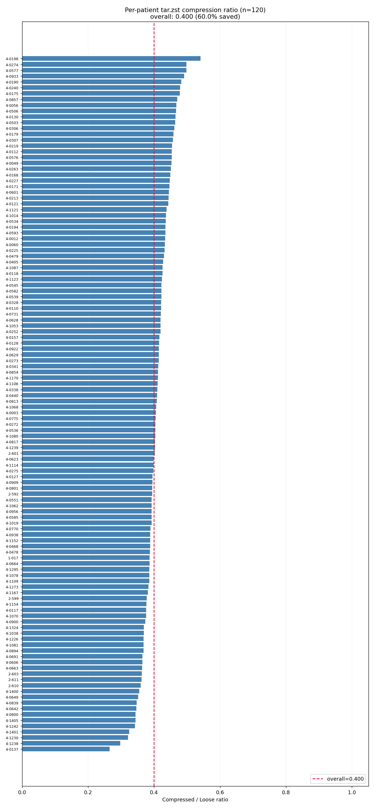
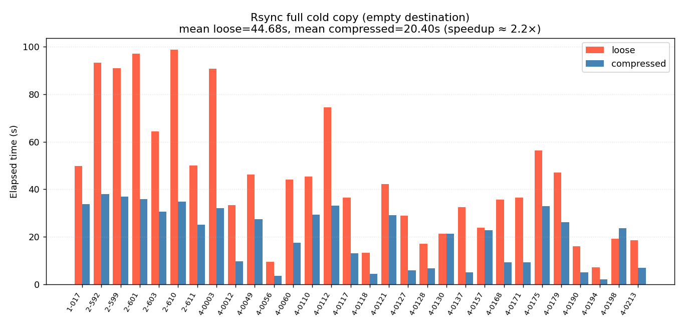
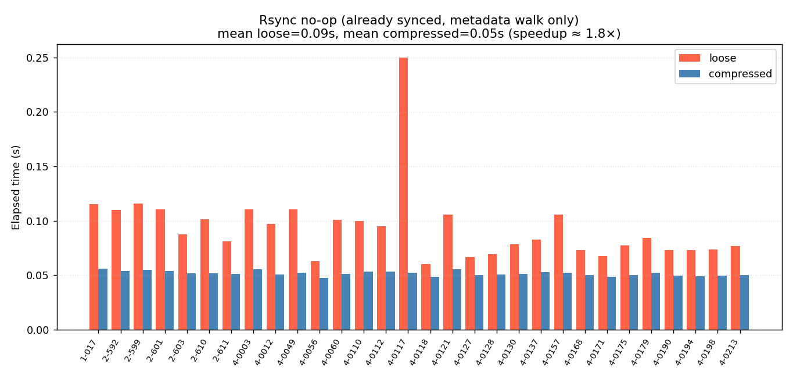
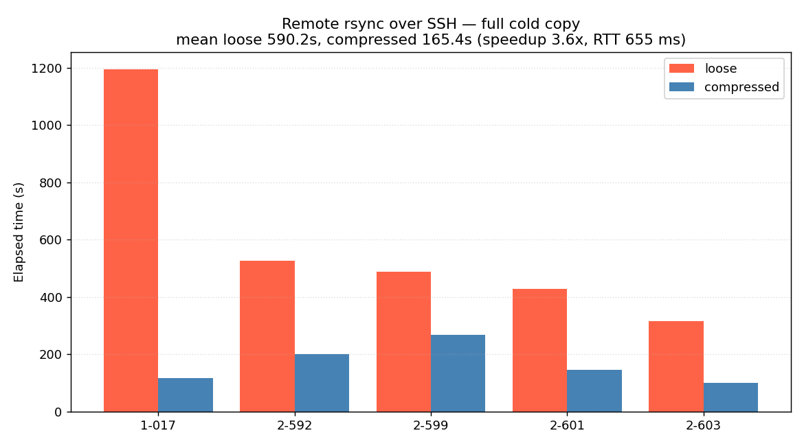
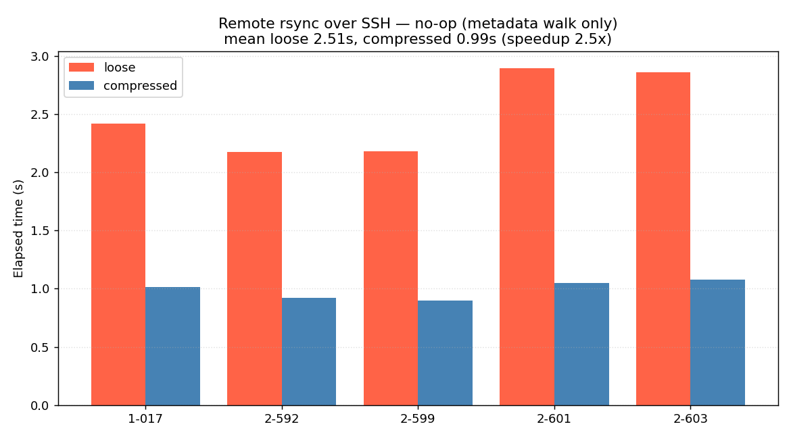
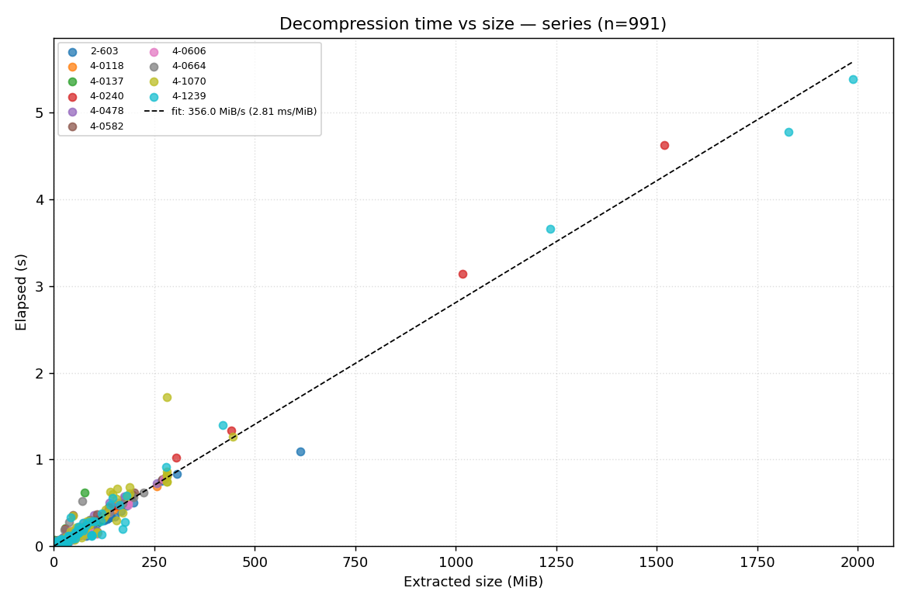
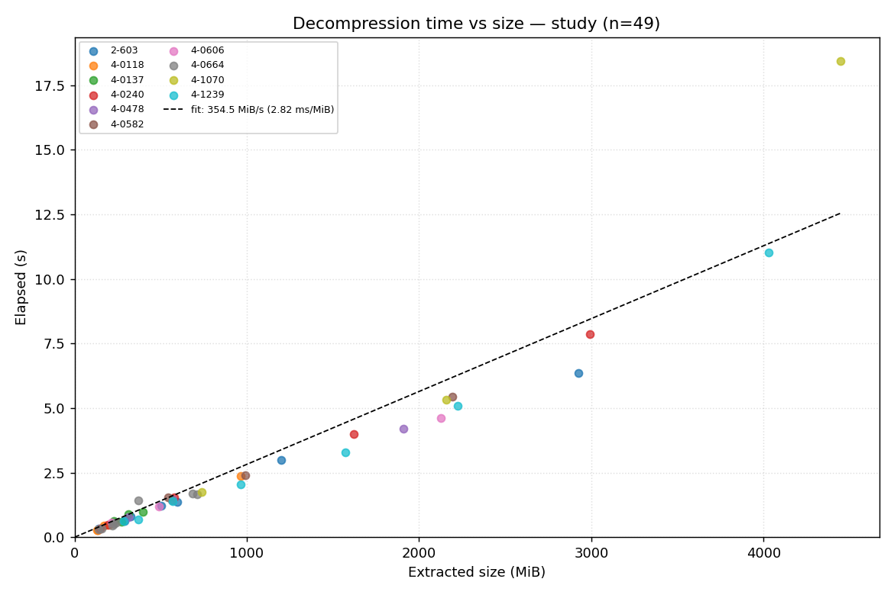

# Cold storage benchmark report

- Host: `stroke`
- Timestamp: 2026-04-13 10:45:40 -0700
- Loose root: `/DATA2/pacs_imaging_data_loose_backup`
- Compressed root: `/DATA2/pacs_imaging_data_compressed`
- Rsync scratch: `/DATA2/pacs_hot_cache/cold_storage_report_rsync` (same filesystem as sources)

## Summary

- **Storage saved:** 359.56 GiB (60.0% of loose footprint), ratio = 0.400
- **Loose footprint:** 598.85 GiB across 120 patients / 1,131,694 DICOM files
- **Compressed footprint:** 239.29 GiB across 13,801 tar.zst archives
- **Rsync full, local same-fs (mean, n=30):** loose 44.68s, compressed 20.40s → 2.2× speedup
- **Rsync no-op, local same-fs (mean, n=30):** loose 0.09s, compressed 0.05s → 1.8× speedup
- **Rsync full, remote over SSH (mean, n=5):** loose 590.2s, compressed 165.4s → **3.6× speedup** (655 ms RTT)
- **Rsync no-op, remote over SSH (mean, n=5):** loose 2.51s, compressed 0.99s → 2.5× speedup
- **Decompression (series, n=991):** 345.5 MiB/s mean throughput
- **Decompression (study, n=49):** 385.4 MiB/s mean throughput

## 1. Storage footprint

Walks both trees on disk; no DB dependency. Archive format is per-series `*.tar.zst` under the compressed root; loose tree has one file per DICOM slice.

<!--  -->

### Aggregate

| metric | loose | compressed |
|---|---|---|
| total bytes | 598.85 GiB | 239.29 GiB |
| items | 1,131,694 files | 13,801 archives |
| ratio (c/l) | — | **0.400** (60.0% saved) |

## 2. Backup speed (rsync)

First 30 patient_ids (alphabetical) common to both trees. Each patient is rsynced to a scratch directory on the **same filesystem** as the source (`/DATA2`), twice: once cold (empty destination → full copy), and once no-op (destination already populated → metadata walk only).

**Caveats:**
- Same-fs rsync captures CPU, metadata-walk, and local IO costs but **not** network throughput. Absolute speeds understate wins for remote backups.
- The loose-vs-compressed **ratio** is still meaningful: the compressed tree has O(archives) files vs. O(slices), and DICOM backups are usually metadata-bound at scale.





### Remote rsync over SSH (client-side, n=5)

Measured from a client laptop pulling from the server over SSH
(`rsync -a -e ssh`). First 5 patient_ids in the same alphabetical sample.
Each patient is pulled fresh to the laptop (full cold copy), then rsync is
re-run against the populated destination (no-op / metadata walk), for both
the loose and the compressed tree.

Link characteristics:
- Client: `DNa82d042.SUNet` (macOS, Python 3.9.13)
- Server: `10.110.128.149`
- SSH round-trip probe: **655 ms** — fairly high-latency link, so per-file
  round-trip overhead dominates for the loose tree.





#### Full cold copy (remote)

| patient_id | loose (s) | loose size | loose throughput | compressed (s) | compressed size | compressed throughput | speedup |
|---|---:|---:|---:|---:|---:|---:|---:|
| `1-017` | 1,195.4 | 5.37 GiB | 4.8 MB/s | 115.7 | 2.08 GiB | 19.3 MB/s | **10.3×** |
| `2-592` | 526.7 | 8.90 GiB | 18.1 MB/s | 199.6 | 3.51 GiB | 18.9 MB/s | 2.6× |
| `2-599` | 486.8 | 8.07 GiB | 17.8 MB/s | 267.5 | 3.05 GiB | 12.2 MB/s | 1.8× |
| `2-601` | 426.8 | 8.40 GiB | 21.1 MB/s | 145.5 | 3.38 GiB | 24.9 MB/s | 2.9× |
| `2-603` | 315.5 | 6.37 GiB | 21.7 MB/s | 98.7 | 2.31 GiB | 25.2 MB/s | 3.2× |
| **mean** | **590.2** | — | — | **165.4** | — | — | **3.6×** |

#### No-op (metadata walk, remote)

| patient_id | loose (s) | compressed (s) | speedup |
|---|---:|---:|---:|
| `1-017` | 2.42 | 1.01 | 2.4× |
| `2-592` | 2.18 | 0.92 | 2.4× |
| `2-599` | 2.18 | 0.90 | 2.4× |
| `2-601` | 2.90 | 1.05 | 2.8× |
| `2-603` | 2.86 | 1.08 | 2.6× |
| **mean** | **2.51** | **0.99** | **2.5×** |

#### Observations

- The remote speedup (**3.6× full**) is noticeably larger than the
  local same-fs speedup (2.2×). On a real link the per-file SSH/rsync
  round-trip dominates for the loose tree; the compressed tree has
  ~23× fewer files per patient (596 vs 14,348 for `1-017`), so the
  network pays the round-trip cost many fewer times.
- Patient `1-017` is a large outlier at **10.3×**: it happens to have
  the highest file count in the sample (14,348). The loose pull runs at
  just 4.8 MB/s — bandwidth-starved by small-file round-trips. The same
  patient's compressed pull runs at 19.3 MB/s, which is roughly the
  link's sustained throughput.
- No-op speedup is stable at ~2.4-2.8× for every patient: rsync still
  round-trips file metadata for all 12-14k loose files even when
  nothing needs to be transferred, and over a 655 ms link that is
  unavoidable. Compressed's ~1 second no-op is mostly the fixed SSH
  handshake.
- Throughput tells the same story from the other direction: loose is
  capped around 4-22 MB/s (per-file overhead), compressed averages
  ~20 MB/s and approaches the link's ceiling.
- A full backup of all 120 patients, extrapolated from the means:
  loose ≈ 120 × 590 s = **19.7 hours**, compressed ≈ 120 × 165 s =
  **5.5 hours**. Real backups would benefit from parallelism but the
  ratio should hold.

## Archive integrity audit

A full-corpus scan of the compressed root (`verify_and_repair_archives.py`,
8 workers) streamed every `*.tar.zst` through zstd + tarfile and read
each member's payload in 1 MiB chunks. **46 of 13,801 archives (0.33%)
were corrupt** at the time of the initial benchmark — all raised
`tarfile.ReadError: unexpected end of data`, indicating the tar stream
was truncated during compression. They were concentrated in 15 patients
(`4-0137` and `4-1238` accounted for 24 of the 46 on their own).

Every corrupt archive had a matching loose backup, so all 46 were
rebuilt from `/DATA2/pacs_imaging_data_loose_backup` with
`--repair --execute`. Total rebuild time was 307 s for 2.77 GiB of new
archive data; all 46 passed a post-rebuild verify pass.

After the repair run, a re-verification is recommended periodically
(the whole-corpus scan takes ~34 minutes on 8 workers). Results are
persisted to `scripts/verify_and_repair_archives_results.json`.

## 3. Decompression cost

10 patients evenly spaced across the loose-footprint size distribution. Each series is extracted individually to a scratch dir (isolated); each study is extracted as a sequential bundle of its series (mimics the `cache_manager.warm_study` flow).





### Series — throughput distribution

- n = 991
- p10 / p50 / p90 throughput: 69.2 / 308.8 / 522.3 MiB/s

### Study — throughput distribution

- n = 49
- p10 / p50 / p90 throughput: 365.3 / 412.5 / 473.9 MiB/s

## Method

- Script: `benchmarks/cold_storage_report.py`
- Reused primitives from `benchmarks/cold_storage_evaluation.py`
- CLI args:
```json
{
  "loose_root": "/DATA2/pacs_imaging_data_loose_backup",
  "compressed_root": "/DATA2/pacs_imaging_data_compressed",
  "rsync_dest": "/DATA2/pacs_hot_cache/cold_storage_report_rsync",
  "decompress_scratch": "/DATA2/pacs_hot_cache/cold_storage_report_decompress",
  "rsync_n": 30,
  "decompress_n": 10,
  "phases": [
    "rsync",
    "decompress",
    "report"
  ]
}
```
