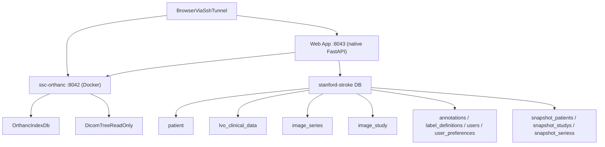

# Stanford Stroke Center PACS Architecture

**Purpose:** High-level deployed architecture — topology, service roles, data flows, auth, and portability. For database detail see [`data_stores.md`](data_stores.md). For packaging and config files see [`runtime_and_config.md`](runtime_and_config.md).

This document explains the deployed architecture of the PACS stack and which
parts are reusable versus specific to the current Stanford Stroke Center (SSC)
database.

---

## 1. Topology

The repo deploys one Docker service (Orthanc) and one native host service
(the web app), and relies on one existing host PostgreSQL server plus an
existing DICOM filesystem.

User-facing entry points:

- `http://localhost:8042/ui/app/` for Orthanc Explorer 2
- `http://localhost:8042/ohif/` for OHIF
- `http://localhost:8043/` for the landing page
- `http://localhost:8043/app/` for the web app app

The repo does not include a reverse proxy. In the current deployment model,
users normally reach these ports through an SSH tunnel.

---

## 2. Service roles

### 2.1 Orthanc

The `orthanc` service (container `ssc-orthanc`) is the PACS viewer/indexer layer.

It is responsible for:

- scanning the read-only DICOM tree through the Folder Indexer
- maintaining an internal PostgreSQL index
- serving Orthanc Explorer 2
- serving OHIF
- exposing DICOMweb and the Orthanc REST API
- storing study-level shared labels used by Orthanc Explorer 2

It is not responsible for:

- owning the source DICOM files
- generating the upstream `image_series` and `image_study` metadata tables
- storing web app annotations

### 2.2 Web App

The web app is a FastAPI application that runs natively on the host (managed
by systemd), serving a React frontend and a REST API for multi-level
annotation workflows that Orthanc Explorer 2 does not support.

It is responsible for:

- browsing patients (from the `patient` registry, LEFT JOINing
  `lvo_clinical_data` for the clinical `stroke_date`), studies (from
  `image_study`), and series (from `image_series`, JOINing `image_study` for `study_type`)
- storing multi-level annotations (patient, study, series) in `annotations`
- storing level-aware label definitions in `label_definitions`
- cross-level label filtering (e.g. filtering patients by a series-level label)
- inheriting parent-level annotations down to child rows
- building refreshable snapshot tables for bulk export
- authenticating users against `users`
- generating study- and series-aware OHIF links by querying Orthanc
- embedding OHIF inside the Navigator UI as a lower preview pane for row-driven
  image review

It is not responsible for:

- indexing DICOMs
- owning the main PACS metadata index
- replacing Orthanc Explorer 2

---

## 3. Dual-database model

The most important architectural feature is the split between two logical
PostgreSQL databases.

### 3.1 Orthanc index DB

Orthanc uses its own database, typically `orthanc_db`, for internal tables
managed by the Orthanc PostgreSQL plugin.

Key properties:

- operational infrastructure for Orthanc itself
- populated by Orthanc's Folder Indexer and plugin logic
- used for PACS metadata lookup and web UI behavior
- configured through `ORTHANC__POSTGRESQL__*` environment variables
- run with `ENABLE_INDEX=true` and `ENABLE_STORAGE=false`

This means:

- Orthanc indexes metadata in PostgreSQL
- Orthanc does not duplicate the DICOM files into PostgreSQL
- the canonical image payload stays on disk

### 3.2 Research / app DB

The second logical database is the research/application database, currently
`stanford-stroke`.

It contains:

- the existing read-only source tables `patient`, `lvo_clinical_data`,
  `image_series`, and `image_study`
- web-app-owned tables:
  - `annotations` — multi-level (patient/study/series) with shared partial
    unique indexes per level (one value per entity+label; `created_by`
    tracks who last edited)
  - `label_definitions` — level-aware label registry supporting bool, int,
    text, and select datatypes
  - `label_value_options` — known values (controlled vocabulary) per
    select-type label; fast indexed lookup kept in sync on annotation writes
    (replaces a `SELECT DISTINCT` scan of `annotations`)
  - `users`
  - `user_preferences` — per-user JSONB table display preferences (column
    visibility, order, sort, filters, frozen state) keyed by username and
    level
- refreshable snapshot tables: `snapshot_patients`, `snapshot_studys`,
  `snapshot_seriess`

Optional cold-storage support adds columns and tables documented in
[`data_stores.md`](data_stores.md).

This database is where the web app app gets its patient, study, and series
listings and where it stores user-generated annotations and label definitions.

### 3.3 Why the split exists

The two-database design keeps responsibilities clean:

- Orthanc's operational index stays isolated from research metadata tables
- the web app can evolve its own schema without touching Orthanc internals
- the DICOM tree can remain external and read-only
- the same host PostgreSQL server can support both layers without mixing roles

---

## 4. Data flow

### 4.1 Imaging data

1. DICOM files exist on the host filesystem at `/DATA2/pacs_imaging_data`.
2. Docker bind-mounts that tree read-only into the Orthanc container as
   `/dicom-data`.
3. Orthanc's Folder Indexer scans the mount and writes its internal metadata
   index into the Orthanc PostgreSQL database.
4. OHIF and Orthanc Explorer 2 read through Orthanc, not directly from the
   research database.

The DICOM Application Entity Title (AE Title) is configured as `SSC`.

**Optional cold storage mode** (`mode = "cold_path_cache"` under `[storage]` in repo-root `config.toml`):
canonical series payloads live as `*.tar.zst` under `cold_archive_root` (`/DATA2/pacs_imaging_data_compressed`).
On warm, the web app extracts an archive back to the **original** `dicom_dir_path` recorded in
`image_series`; on evict it deletes those extracted files. This requires the custom
`ssc-orthanc:patched-indexer` image with `"RemoveMissingFiles": false`, so Orthanc's index keeps
pointing at the original paths even while the files are absent — no re-ingestion is needed.
Legacy loose files under `/DATA2/pacs_imaging_data` are read directly when `mode = "legacy"`.
(An earlier `cold_cache` design that warmed into a separate `/DATA2/pacs_hot_cache` and re-POSTed
DICOMs to Orthanc was removed — see [`../cold_storage/design.md`](../cold_storage/design.md).)

- Design rationale and benchmarks: [`../cold_storage/design.md`](../cold_storage/design.md)
- Operator steps and component map: [`../cold_storage/runbook.md`](../cold_storage/runbook.md)

### 4.2 Metadata and annotations

1. `patient`, `lvo_clinical_data`, `image_series`, and `image_study` provide the
   metadata that drives the web app app (patient browsing from `patient`,
   `lvo_clinical_data` joined for the clinical `stroke_date`).
2. The web app reads these tables to build patient, study, and series browsers
   with filtering, sorting, and pagination. Series listings JOIN `image_study`
   for `study_type`.
3. Web App writes shared annotations at three levels (patient, study,
   series) and level-aware label definitions back into the same research/app
   database. Annotations are global: any user can edit any annotation, and
   the value is shared across all users (`created_by` tracks the last
   editor).
4. Annotations inherit downward: parent-level annotations are attached to child
   rows as `inherited_annotations`. Cross-level filtering allows filtering any
   level by annotations at a different level.
5. When a study or series row is selected in the web app, the backend builds
   an OHIF viewer URL and the frontend can load it inside an embedded preview
   pane. Study selections load the study viewer; series selections use a
   series-specific OHIF URL scoped to that study.
6. Orthanc study labels are stored inside Orthanc and manipulated via Orthanc's
   UI or REST API, not through the web app tables.

### 4.3 Optional enrichment layer

`scripts/orthanc/enrich_orthanc.py` is an extra display-enrichment step:

- it reads `patient_id` from `image_series` and `studydescription` from
  `image_study` (via JOIN)
- it then mutates Orthanc's PostgreSQL index tables so Orthanc Explorer 2 shows
  more useful identifiers than the anonymized DICOM headers provide
- Patient ID and Patient Name are set from `patient_id`
- Study Description is set from `image_study.studydescription`
- Series Description is set from `image_series.seriesdescription`

This is important for the current dataset, but it is not fundamental to the
architecture.

---

## 5. Authentication model

End-user authentication is single-sourced from the PostgreSQL `users` table.
The web app is the only login point for end users; it reverse-proxies
OHIF and DICOMweb to Orthanc on the user's behalf.

### 5.1 Web App auth (end users)

The web app authenticates against `users`:

- passwords are bcrypt hashes
- login returns a JWT cookie
- authenticated writes use the JWT identity as `created_by`
- `/ohif/*` and `/dicom-web/*` are reverse-proxied to Orthanc by the web app
  (see `web-app/routes/proxy.py`), attaching the service-account credential
  from `.env`. End users never present credentials to Orthanc directly.

### 5.2 Orthanc auth (service account + admins only)

`orthanc_users.json` is no longer a runtime user store. It contains:

- the **service account** (matching `ORTHANC_ADMIN_USER` / `ORTHANC_ADMIN_PASSWORD`
  in `.env`), used by the web app to proxy requests on behalf of any logged-in
  user, and by host-local maintenance scripts
- each **admin user** (`users.is_admin = TRUE`), so admins can log in to
  `:8042/ui/app/` (Orthanc Explorer 2) and `:8042/ohif/` as themselves with
  per-user attribution in Orthanc's own logs

The file is owned by `scripts/admin/manage_users.py`; do not edit by hand.

### 5.3 Shared provisioning

`scripts/admin/manage_users.py` is the canonical tool for both stores:

- `add` / `passwd` / `remove` always touch the `users` table; they also update
  `orthanc_users.json` when `is_admin=True`
- `add --datasets <csv>` / `set-datasets` manage per-user dataset grants
  (see 5.4)
- `rotate-service-account` rewrites `ORTHANC_ADMIN_PASSWORD` in `.env` and the
  matching entry in `orthanc_users.json` atomically. It does not touch the DB.

### 5.4 Dataset-level authorization (per-user cohort access)

Beyond authentication, every non-admin user carries a **dataset scope**:
`users.allowed_datasets text[]`, a subset of the cohort tags found in
`patient.dataset` (e.g. `PRECISE`, `CRISP2/LVO`).

- **Deny by default** — an empty grant set (the default for new users) means
  the user sees *no* patient data until an admin grants datasets.
- **Admins bypass** — `is_admin = TRUE` ignores the scope entirely.
- **Enforced server-side on every endpoint** that returns or mutates
  patient-derived data:
  - the list endpoints (`/api/patients`, `/api/studies`, `/api/series`, plus
    sidebar option endpoints) filter rows to patients whose `dataset`
    overlaps the scope (`dataset && allowed`);
  - detail endpoints keyed by a patient/study/series id (sub-row listings,
    `/api/ohif-link`, warm/evict/cache-status, annotation reads/writes)
    return **404** for out-of-scope ids, so they are indistinguishable from
    nonexistent ones;
  - the DICOMweb reverse proxy extracts the StudyInstanceUID from each
    `/dicom-web/*` request (path or QIDO query param) and rejects
    out-of-scope studies with 403. Lookups are served from in-process TTL
    caches (`web-app/dataset_access.py`: user scope 30 s, study→datasets
    5 min), so per-frame WADO requests cost no DB round-trips. Unscoped QIDO
    searches are denied for non-admins.
- **Managed by**: the `/admin` page (admin-only, users × dataset checkboxes,
  `GET /api/admin/users` + `PUT /api/admin/users/{username}/datasets`) or
  `scripts/admin/manage_users.py set-datasets`.

Known limitation: `/api/labels` and `/api/labels/summary` expose label names
and aggregate counts across all data (no identifiers or values).
`/api/labels/{name}/values` returns a select label's controlled vocabulary
from the `label_value_options` table — a **global** value set, not scoped per
dataset (only the value strings are shared, never patient data).

---

## 6. Packaging model

### 6.1 Orthanc packaging

Orthanc uses the upstream image `orthancteam/orthanc:latest`.

The repo provides:

- `docker-compose.yml` for service wiring
- `orthanc.json` for structural config
- `orthanc_users.json` as a deploy-time file holding the service account plus
  admin users (rotated via `scripts/admin/manage_users.py`)

### 6.2 Web App packaging

The web app runs natively on the host (no Docker container):

- FastAPI served by uvicorn, managed by a systemd unit (`ssc-web-app.service`)
- Python dependencies installed in the `pacs` conda environment
- React frontend built with Vite + Tailwind CSS into `web-app/dist/`
- FastAPI serves the built frontend as static files and provides the REST API
- Node.js and npm are only needed at build time (to run `npm run build`);
  no Node process runs in production

To rebuild the frontend after changes: `cd web-app && npm run build`.
To restart the service: `sudo systemctl restart ssc-web-app`.

---

## 7. Portable versus site-specific parts

### 7.1 Portable core

These parts are broadly reusable on another server if the target deployment will
follow the same pattern:

- `docker-compose.yml` (Orthanc only)
- `orthanc.json`
- `web-app/` (FastAPI backend + React frontend)
- `ssc-web-app.service` (systemd unit)
- `scripts/admin/manage_users.py`
- `init_orthanc_db.sh`

`scripts/orthanc/label_studies.py` is also fairly portable as long as the source metadata tables
(`image_series` and `image_study`) still provide:

- `studyinstanceuid`
- `study_type` (from `image_study`)
- `modality` (from `image_series`)

### 7.2 Site-specific parts

These parts depend on the SSC metadata conventions or local filesystem
assumptions.

`scripts/orthanc/enrich_orthanc.py` is specific to deployments where:

- the DICOM headers are too anonymized to be useful in Orthanc Explorer 2
- you want OE2 columns to show values from `image_series` and `image_study`
- you are willing to mutate Orthanc's PostgreSQL index tables directly

`image_ingestion_protocols/` is strongly site-specific:

- it is the legacy pipeline that created and curated `image_series` and
  `image_study`
- it assumes SSC-specific directory layouts and metadata rules
- it contains local path assumptions and dataset-specific heuristics
- it is not part of standard PACS deployment on a fresh server

### 7.3 Practical guidance for new deployments

If a new server already has:

- a DICOM tree
- a PostgreSQL server
- metadata tables equivalent to `patient`, `image_series`, `image_study`, and
  (optionally) `lvo_clinical_data`

then the PACS stack can usually be redeployed without using
`image_ingestion_protocols/`. The patient tab is sourced from the `patient`
registry; `lvo_clinical_data` is an optional clinical side-table — if absent,
the patient tab still works and shows the imaging-derived `stroke_date` instead
of the clinical one.

If the new deployment does not already have equivalent metadata tables, that
metadata-ingestion problem must be solved separately from the PACS deployment.

---

## 8. Operational caveats

Current repo behavior that matters architecturally:

- `scripts/orthanc/check_status.sh` reads Orthanc credentials from repo-root `.env` (`ORTHANC_ADMIN_USER` / `ORTHANC_ADMIN_PASSWORD`)
- all Orthanc-facing helper scripts use `ORTHANC_ADMIN_USER` /
  `ORTHANC_ADMIN_PASSWORD` from `.env`
- `scripts/admin/teardown.sh` is destructive (removes Orthanc resources, not just running
  containers) and sources `.env` from two levels above the repo root — not the
  repo-root `.env` used by everything else

These are documentation-relevant caveats, not fundamental design choices.
